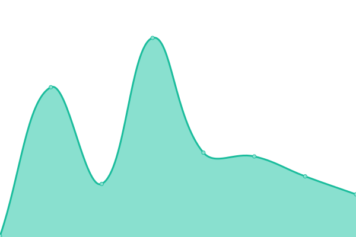

# [📈 Live Status](https://ricardona.github.io/statuspage): <!--live status--> **Todos los sistemas están operativos**

This repository contains the open-source uptime monitor and status page for [Ricardo Cardona Ramirez](https://www.linkedin.com/in/ricardo-cardona-ramirez-668b4122/), powered by [Upptime](https://github.com/upptime/upptime).

With [Upptime](https://upptime.js.org), you can get your own unlimited and free uptime monitor and status page, powered entirely by a GitHub repository. We use [Issues](https://github.com/ricardona/statuspage/issues) as incident reports, [Actions](https://github.com/ricardona/statuspage/actions) as uptime monitors, and [Pages](https://ricardona.github.io/statuspage) for the status page.

<!--start: status pages-->
<!-- This summary is generated by Upptime (https://github.com/upptime/upptime) -->
<!-- Do not edit this manually, your changes will be overwritten -->
<!-- prettier-ignore -->
| URL | Status | History | Response Time | Uptime |
| --- | ------ | ------- | ------------- | ------ |
|  AXA | Arriba | [axa.yml](https://github.com/imedicalservices/statuspage/commits/HEAD/history/axa.yml) | 

 164ms
     
 | 

<a href="https://status.imedicalcloud.net/history/axa">100.00%</a>
    

|  Central | Arriba | [central.yml](https://github.com/imedicalservices/statuspage/commits/HEAD/history/central.yml) | 

 182ms
     
 | 

<a href="https://status.imedicalcloud.net/history/central">100.00%</a>
    

|  Comfamiliar | Arriba | [comfamiliar.yml](https://github.com/imedicalservices/statuspage/commits/HEAD/history/comfamiliar.yml) | 

 179ms
     
 | 

<a href="https://status.imedicalcloud.net/history/comfamiliar">100.00%</a>
    

|  Consultorios | Arriba | [consultorios.yml](https://github.com/imedicalservices/statuspage/commits/HEAD/history/consultorios.yml) | 

 169ms
     
 | 

<a href="https://status.imedicalcloud.net/history/consultorios">100.00%</a>
    

|  IPS | Arriba | [ips.yml](https://github.com/imedicalservices/statuspage/commits/HEAD/history/ips.yml) | 

 153ms
     
 | 

<a href="https://status.imedicalcloud.net/history/ips">100.00%</a>
    

|  Norte | Arriba | [norte.yml](https://github.com/imedicalservices/statuspage/commits/HEAD/history/norte.yml) | 

 152ms
     
 | 

<a href="https://status.imedicalcloud.net/history/norte">100.00%</a>
    

|  OCC | Arriba | [occ.yml](https://github.com/imedicalservices/statuspage/commits/HEAD/history/occ.yml) | 

 146ms
     
 | 

<a href="https://status.imedicalcloud.net/history/occ">100.00%</a>
    

|  Oriente | Arriba | [oriente.yml](https://github.com/imedicalservices/statuspage/commits/HEAD/history/oriente.yml) | 

 141ms
     
 | 

<a href="https://status.imedicalcloud.net/history/oriente">100.00%</a>
    

|  Santa Ana | Arriba | [santa-ana.yml](https://github.com/imedicalservices/statuspage/commits/HEAD/history/santa-ana.yml) | 

 150ms
     
 | 

<a href="https://status.imedicalcloud.net/history/santa-ana">100.00%</a>
    

|  Universidades | Arriba | [universidades.yml](https://github.com/imedicalservices/statuspage/commits/HEAD/history/universidades.yml) | 

 149ms
     
 | 

<a href="https://status.imedicalcloud.net/history/universidades">100.00%</a>
    

|  Teleconsulta | Arriba | [teleconsulta.yml](https://github.com/imedicalservices/statuspage/commits/HEAD/history/teleconsulta.yml) | 

 269ms
     
 | 

<a href="https://status.imedicalcloud.net/history/teleconsulta">100.00%</a>
    

<!--end: status pages-->

[**Visit our status website →**](https://ricardona.github.io/statuspage)

## 📄 License

- Powered by: [Upptime](https://github.com/upptime/upptime)
- Code: [MIT](./LICENSE) © [Ricardo Cardona Ramirez](https://www.linkedin.com/in/ricardo-cardona-ramirez-668b4122/)
- Data in the `./history` directory: [Open Database License](https://opendatacommons.org/licenses/odbl/1-0/)
